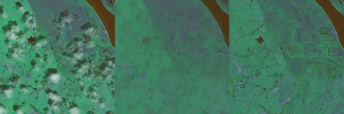

# Patch-GAN Transfer Learning with Reconstructive Models for Cloud Removal

[](https://arxiv.org/abs/2501.05265)
[](LICENSE)

This repository provides the official implementation of the paper:

> **Patch-GAN Transfer Learning with Reconstructive Models for Cloud Removal**  
> Wanli Ma, Oktay Karakuş, Paul L. Rosin  
> Cardiff University, School of Computer Science and Informatics  
> [arXiv:2501.05265v1](https://arxiv.org/abs/2501.05265)

---

## 🔍 Overview

Clouds frequently obscure optical satellite imagery, limiting its utility in remote sensing tasks. We propose a novel **deep transfer learning** method leveraging a **Masked Autoencoder (MAE)** and a **Patch-based GAN** for accurate cloud removal.

- Utilizes **pre-trained MAE (ViT-large)** on ImageNet for robust reconstruction.
- Introduces a **patch-wise discriminator** to better assess local image realism.
- Achieves **state-of-the-art performance** on RICE1 and RICE2 datasets.

<p align="center">
  
</p>

---

## 🧠 Method

### Generator
- Based on a Vision Transformer (ViT-large) encoder-decoder architecture.
- Initialized from a pre-trained MAE for image reconstruction.

### Discriminator
- Patch-wise classification (196 × 16×16 RGB patches) using a fully connected network.
- Each patch is evaluated as real/fake individually.

### Loss Functions
- **Reconstruction Loss**: Mean Squared Error (MSE)
- **Adversarial Loss**: Patch-level GAN loss

---

## 📊 Results

| Model            | RICE1 SSIM | RICE2 SSIM |
|------------------|-------------|-------------|
| Conditional GAN  | 0.903       | 0.811       |
| Cycle GAN        | 0.893       | 0.793       |
| SpA-GAN          | 0.954       | 0.906       |
| **Ours**         | **0.976**   | **0.955**   |

<p align="center">
  <br>
  <br>
  <em> From left to right are the cloud-covered image, the generated cloud-free image, and the ground truth cloud-free image.</em>
</p>

---

## 📁 Dataset

We use the [RICE Dataset](https://github.com/BUPTLdy/RICE_DATASET):

- **RICE1**: 500 pairs of 512×512 cloudy and cloud-free images.
- **RICE2**: 736 triplets with cloudy, cloud-free, and mask images.

---

## 🚀 Getting Started

```bash
# Clone repository
git clone https://github.com/your-username/cloud-removal-patch-gan.git
cd cloud-removal-patch-gan

# Install dependencies
pip install -r requirements.txt
```

### Pretrained MAE (ViT-large + GAN Loss)
Download from [Facebook MAE repository](https://dl.fbaipublicfiles.com/mae/visualize/mae_visualize_vit_large_ganloss.pth)

### Training

```bash
python train.py
```

### Inference

```bash
python test.py
```

---

## 📄 Citation

If you use this work, please cite:

```bibtex
@article{ma2025patchgan,
  title={Patch-GAN Transfer Learning with Reconstructive Models for Cloud Removal},
  author={Ma, Wanli and Karakuş, Oktay and Rosin, Paul L.},
  journal={arXiv preprint arXiv:2501.05265},
  year={2025}
}
```

---

## 📬 Contact

For questions or collaborations, please contact:  
- Wanli Ma (maw13@cardiff.ac.uk)  

---

## 📝 License

This project is released under the MIT License.
